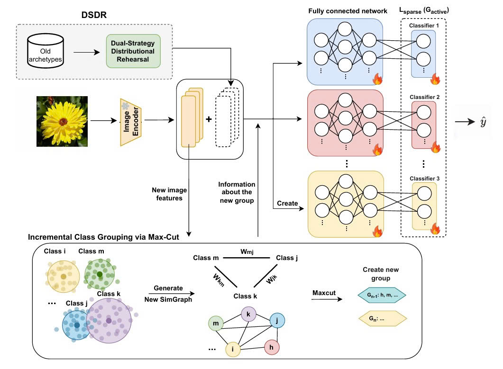

# Semantic Grouping with Dual-Strategy Distributional Rehearsal for Continual Learning

This is the official PyTorch implementation for the WACV 2026 submission paper: **"Semantic Grouping with Dual-Strategy Distributional Rehearsal for Continual
Learning"**.


---

## Environment Setup

To set up the required environment, please follow these steps:

1.  **Create a new conda environment:**
    ```bash
    conda create -n <env name> python=3.8.10 -y
    ```

2.  **Activate the environment:**
    ```bash
    conda activate <env name>
    ```

3.  **Install PyTorch with CUDA 11.7:**
    ```bash
    conda install pytorch==1.13.0 torchvision==0.14.0 torchaudio==0.13.0 pytorch-cuda=11.7 -c pytorch -c nvidia --no-deps
    ```

4.  **Install other dependencies:**
    ```bash
    # Install from requirements.txt
    pip install -r requirements.txt

    # Install CLIP from the OpenAI repository
    pip install git+[https://github.com/openai/CLIP.git](https://github.com/openai/CLIP.git)
    ```

---

## Dataset Preparation

We evaluated our approach on 1 coarse-grained datasets and 4 fine-grained datasets:
* **Coarse-grained:** CIFAR-100
* **Fine-grained:** CUB-200, Flower102, Food101, Stanford-cars

⚠️ **Action Required:** You must specify your data folder path in the `utils/data.py` file. Open the file and modify the `download_data` function:

**Example 1:**
```python
def download_data(self):
    assert 0,"You should specify the folder of your dataset"
    train_dir = '[DATA-PATH]/train/'
    test_dir = '[DATA-PATH]/val/'
```
or
```python
def download_data(self):
    assert 0,"You should specify the folder of your dataset"
    root="/[DATA_PATH]/"
    ....
```

## Model training 
The configuration of hyper-parameters of our method is provided in `exps` folder. You can run an experiment follows:
```bash
python main.py --config=<config json path>

This project is implemented based on the [CLG-CBM](https://github.com/FisherCats/CLG-CBM.git) code.


